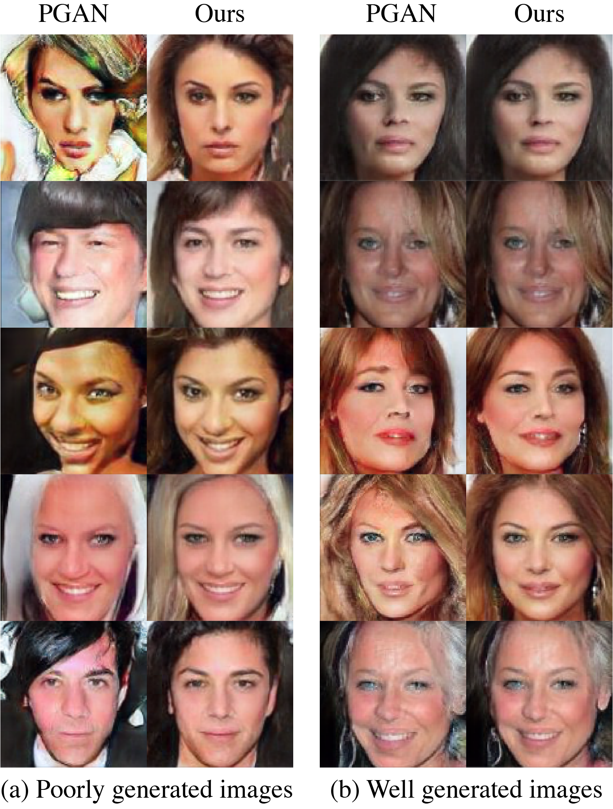

# Diamond in the Rough

This is the implementation of the method proposed in [Diamond in the Rough: improving image realism by traversing the GAN latent space](https://arxiv.org/abs/2104.05518)



Results using our proposed method compared to the original images produced by Progressive Growing of GANs (PGANs). Our method pushes the samples in the latent space towards a direction which provides images with higher photo-realism. 

## Installing
Clone the repository using
```bash
git clone --recurse-submodules https://github.com/jwen307/diamondintherough.git 
```
The ``` --recurse-submodules``` allows you to get the required submodules as well. This can also be accomplished with
```bash
git clone https://github.com/jwen307/diamondintherough.git 

cd diamondintherough

git submodule update --init --recursive

```

## Requirements
To install the requirements, create a new conda environment and activate it
```bash
conda create --name ditr python=3.7.6

conda activate ditr
```
Now add the requirements from the requirements.txt file
```bash
pip install -r requirements.txt
```


## Usage
This code utilizes several different pretrained networks. For convenience, the model weights have been stored in a separate Google drive found [here](https://drive.google.com/drive/folders/1uIkDL3R1AyeVNnYdbem5mNzQpRbDMqaA?usp=sharing). Download the folder name "pretrained" and add it to the model_type directory of this repository.

### Finding improved samples

To run the method as described in the paper, navigate to the main directory of the repo in Terminal. The main method can be run using
```bash
python DitR_main.py --model_type <model> --dataset <dataset> --category<BigGAN categor> --num_samples <number of samples to generate>
```
An example is shown below. To see the other possible inputs, please look at DitR_main.py. 
```bash
python DitR_main.py --model_type 'pgan' --dataset 'celeba'
```
Configuration files with the specific hyperparameters used for the models and datasets in the paper can be found in the 'configs' folder. These configurations are used be default when calling the main method for ease of reproducability. 

The results of the method will be found in the 'results' folder of the main repo directory. 

### Evaluation
To find the protoimage for each sample, run
```bash
python get_all_proto.py --model_type 'pgan' --dataset 'celeba' --num_samples 10000 --minibatch_size 20
```

To increase the speed of the method for application to thousands of images, we can utilize the variation discussed in the Supplemental Material of the paper. This variation takes the mean of the protoimage latent vectors for a large number of samples (1000 by default). Subsequent samples are pushed in the direction of this mean protoimage latent vector to improve the image realism. This reduces the burden of finding a unique protoimage for every sample. 

To find the mean protoimage vector, run
```bash
python get_mean_proto.py --model_type 'pgan' --dataset 'celeba'
```
The optional parameters are the same as for DitR_main.py. 
Note: While we observe similar qualitative improvements to the image realism with a single protoimage, we find the FID score does not improve as it does when each protoimage is found for each sample.

Now, we need to generate at least 10,000 images to evaluate the FID score. For this, we generate images for several different steps along the geodesic between the original vectors and the protoimage vectors. This shows the progression of the FID score as we move along the hypersphere towards the protoimage vectors. To generate these images, run

```bash 
python get_FID_images.py --proto_dir <location of protolatents.pt file> --latent_dir <location of genlatents.pt file>

#Example
python get_FID_images.py --proto_dir 'results/pgan_celeba_trial1/pgan_celeba_protolatents.pt' --latent_dir 'results/pgan_celeba_trial1/pgan_celeba_genlatents.pt'
```

If using the mean protoimage variation, use this instead:
```bash
python get_FID_images.py --proto_dir <location of mean protoimage vector .pt file>

#Example
python get_FID_images.py --proto_dir 'results/pgan_celeba_trial1/pgan_celeba_protomean.pt'
```
Optional parameters should be entered as the same for the get_mean_proto.py.

To get the FID scores, we need the statistics for the respective training datsets. The statistics for the datasets used in the paper have been stored [here](https://drive.google.com/drive/folders/1U_GR9nXFFOMb7yDRU5HxQ678xN3miTb5?usp=sharing). Download the 'dataset_fid_stats' folder and add it to the metrics directory. Now run
```bash
cd metrics
python GetFID.py --fid_img_dir <location of the image folders generated from get_FID_images.py> --dataset_stats_name <name of the stats file>

#Example
python GetFID.py --fid_img_dir  '../results/pgan_celeba_FID_Images/ --dataset_stats_name celebastats.npz'
```
This will show the FID scores and save the scores to a .csv file in the fid_img_dir folder.
If you want to use a different dataset, you can enter the directory of the dataset using the optional parameters.


## Citations

[1] D. Bau, JY. Zhu, J. Wulff, W. Peebles, H. Strobelt, B. Zhou,
and A. Torralba. Seeing what a GAN cannot generate. In
International Conference Computer Vision (ICCV), 2019.

[2] A. Brock, J. Donahue, and K. Simonyan. Large scale GAN
training for high fidelity natural image synthesis. In International Conference on Learning Representations (ICLR).


[3] T. Karras, T. Aila, S. Laine, and J. Lehtinen. Progressive
growing of GANs for improved quality, stability, and varia
tion. In International Conference on Learning Representa
tions (ICLR), 2018.

[4] Yujun Shen, Jinjin Gu, Xiaoou Tang, and Bolei Zhou. Interpreting the latent space of gans for semantic face editing. In
CVPR, 2020.
